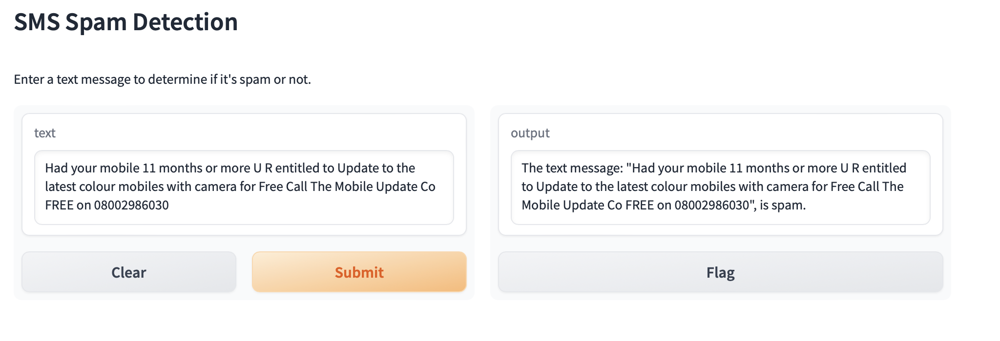

# SMS Text Classification with Gradio

This project demonstrates SMS text classification using machine learning models, specifically TF-IDF vectorization and Linear Support Vector Classification (LinearSVC). The classification model is deployed using Gradio, allowing users to interactively classify text messages as "ham" or "spam".

## Project Structure

- **gradio_sms_text_classification.ipynb**: Jupyter Notebook containing the code for SMS text classification and Gradio interface setup.
- **SMSSpamCollection.csv**: Dataset containing SMS messages labeled as "ham" or "spam".
- **README.md**: Documentation for the project.

## Requirements

- Python 3.x
- Jupyter Notebook
- pandas
- scikit-learn
- Gradio

## Usage

1. Clone the repository:

    ```bash
    git clone <repository-url>
    ```

2. Navigate to the project directory:

    ```bash
    cd sms-text-classification
    ```

3. Open and run the `gradio_sms_text_classification.ipynb` notebook using Jupyter Notebook.

4. Follow the instructions in the notebook to train the SMS text classification model and deploy the Gradio interface.

## Example

Here's how the Gradio interface looks:




## Credits

This project was created by John Andrews.

## License

This project is licensed under the [MIT License](LICENSE).


